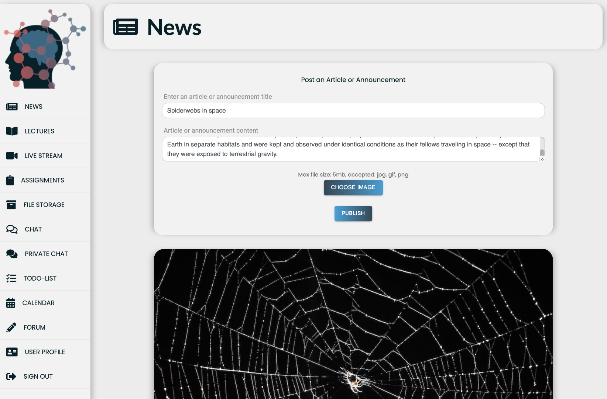
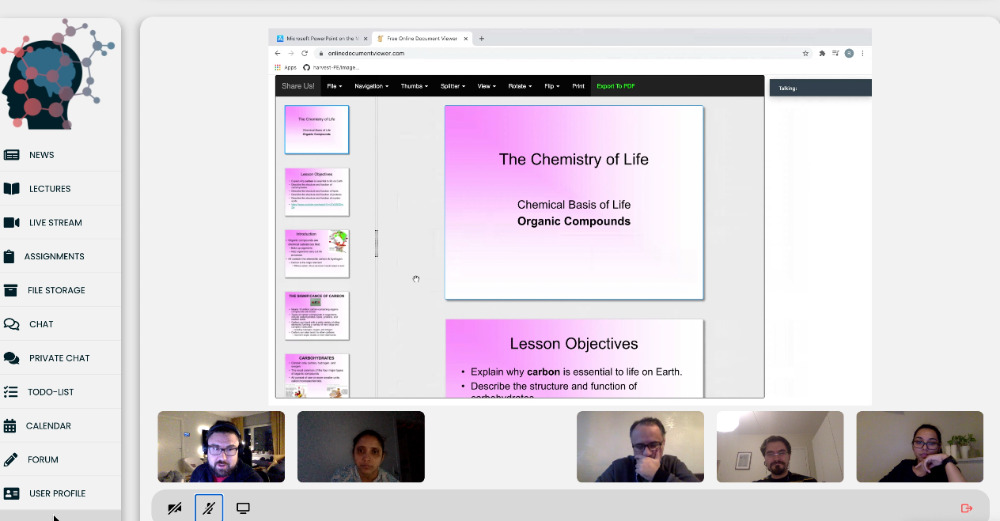
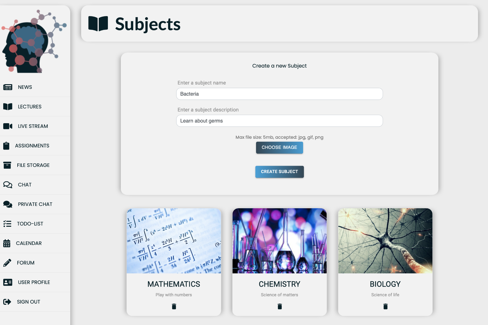
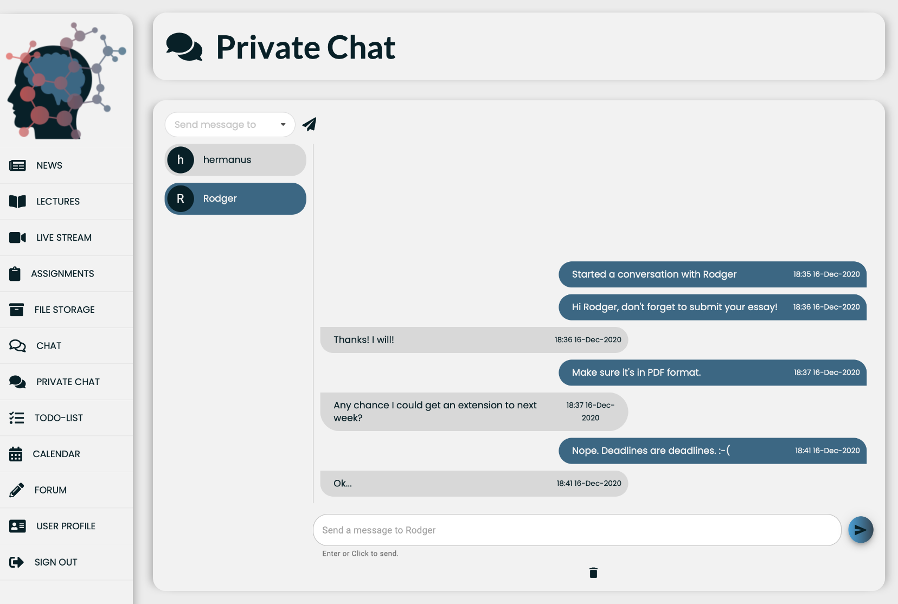
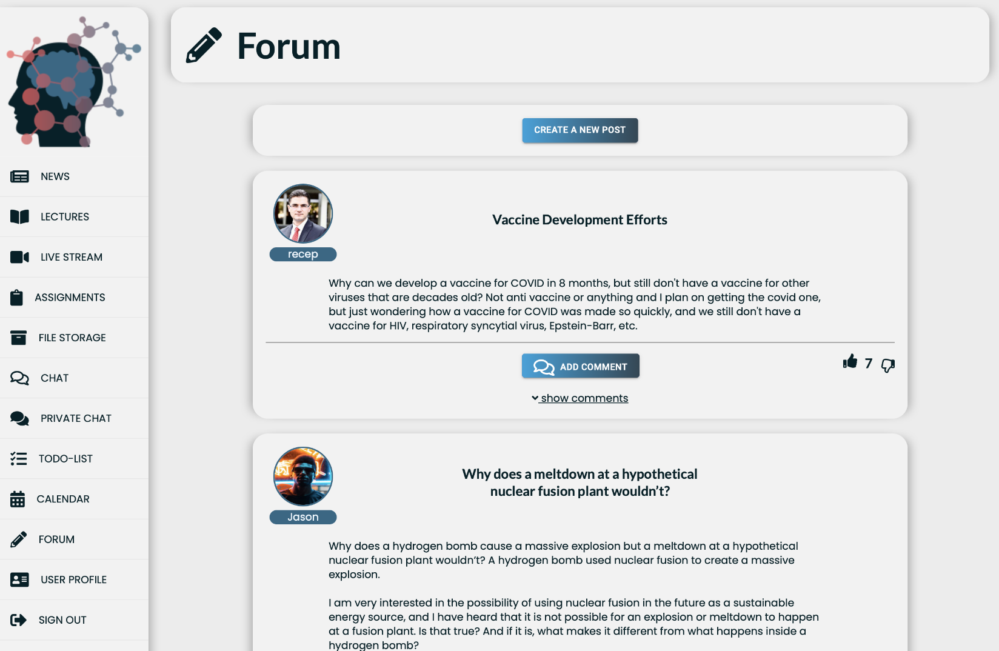

# EDU-Lane

This project attempts to improve studying and teaching remotely as its primary goal.  
The approach to to reach his goal is to implement all the traditional functionalities required by a teacher or student into a single application. Eliminating the need to install multiple applications for file storage, text communication, video communication, scheduling applications etc. It's an all-in-one platform thats easy to use for both student and educator.

## Software Requirements

As the application is web based, any modern browser will suffice. The platform has been tested on the latest versions of Chrome, Edge, Safari and Firefox. Test date (17/12/2020).

## Building the Project
### Front End:
If the back-end is already set up, simply clone and do an  
`npm install`

Some API's are required. A `_sample.env` file is supplied. Please add your own API keys.  
Keys Required:  
- Link To Backend
- API from [Daily](https://www.daily.co/)
- Token from [Daily](https://www.daily.co/)
- Image API from [Cloudinary](https://cloudinary.com/)
- Raw File Storage API from [Cloudinary](https://cloudinary.com/)
- Google API from the [Google Web Platform](https://cloud.google.com/apis)
- Google Calendar ID from your Google calendar settings page. 

### Back End:
#### THIS IS THE FRONT END CODE, [LINK TO BACKEND](https://github.com/Team-200-SDA/back-end)

The project built using [Gradle](https://gradle.org) using the included build file.
You will need an instance of Postgresql and Mongo DB running on your system. Docker is recommended. Configuration is done by Spring. Other DB settings are available in the system.properties file.

## Tech-stack
#### Front End:
- [JavaScript](https://www.javascript.com/)
- [ReactJS](https://reactjs.org/)
#### Back End
- [Spring](https://spring.io/projects/spring-boot)
- [JAVA 11](https://www.oracle.com/java/technologies/javase-jdk11-downloads.html)
- [PostgreSQL](https://www.postgresql.org/)
- [MongoDB](https://www.mongodb.com/)

## Features

- [x] User Authentication (Roles: Teacher/Student)
- [x] News Page (Create/Delete/etc)
- [x] Live Video Conferencing
- [x] Lectures (Upload lecture files and videos)
- [x] Assignments (Upload/Submit assignments)
- [x] Public and Private Chat (Websockets and SSE's)
- [x] ToDo List (Synced with Assignments)
- [x] Cloud Based File and Image Storage
- [x] Calendar
- [x] Forum
- [x] Chatbot
- [x] Multilingual Support
- [x] Dark/Light Mode

